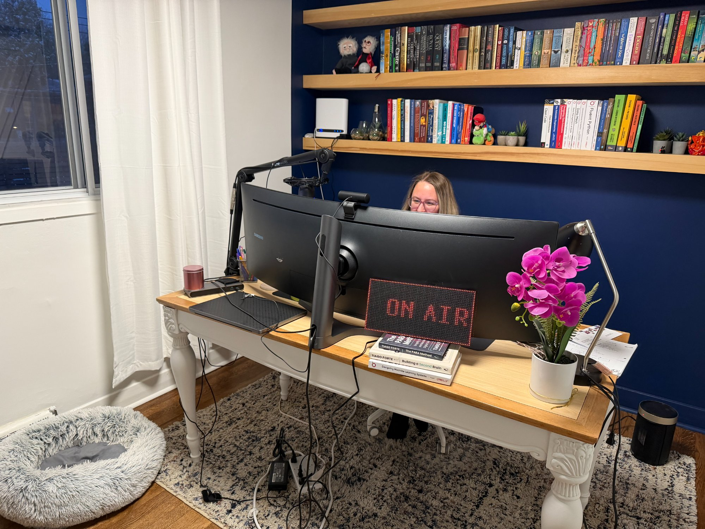
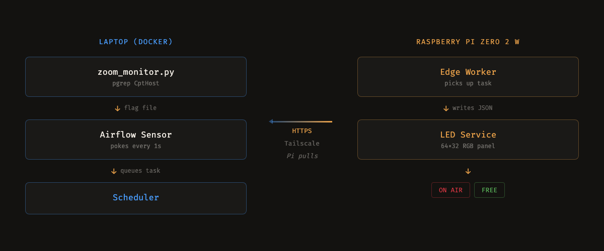
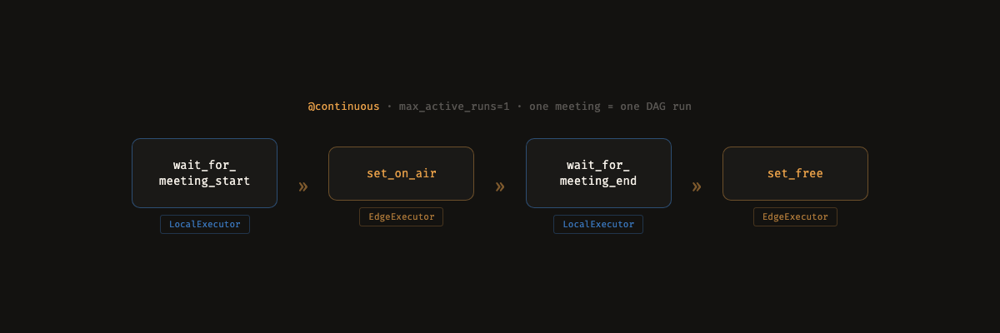
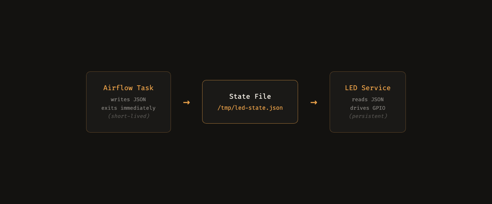

# I Put Apache Airflow on a Raspberry Pi to Tell My Family I'm on a Zoom Call



I work from home. My family has no idea when I'm on a call. They walk in mid-standup, the dog loses it, someone asks me a question while I'm on mute trying to unmute. On camera. Every time.

So I built a sign! An LED panel that says ON AIR in red when I'm in a meeting and FREE in green when I'm not. Problem solved, right?

Well. I'm a product manager for a little known workflow orchestrator called Apache Airflow. If you haven't used it: you write Python functions, wire them into a DAG, and Airflow handles scheduling, retries, and monitoring. Think cron on steroids. 40k+ GitHub stars. Mostly used for data pipelines.

So instead of buying a $30 smart light like a sane person, I put Airflow 3 on a Raspberry Pi Zero 2 W. You heard that right. A $15 computer with 416MB of usable RAM, running an enterprise workflow orchestrator to change the color of some LEDs!

I know. I know.

I ended up turning this into a live demo at PyCascades 2026 — which meant it had to work reliably on conference WiFi with an audience watching.

Here's how it works and what I learned building the world's most over-engineered busy light.

## The system

Four pieces, doing the work of what could honestly be a shell script:

1. A Python script on my laptop that watches for Zoom's meeting process (`CptHost`) using `pgrep`. Zoom starts, file appears. Zoom ends, file disappears.

2. Airflow 3 running in Docker on my laptop. A sensor task pokes every second, watching for that flag file like an anxious golden retriever staring at a door.

3. An Edge Worker on a Raspberry Pi Zero 2 W. When the sensor fires, the scheduler dispatches a task to the Pi over HTTPS.

4. A persistent LED service on the Pi that reads a JSON state file and drives a 64x32 RGB LED panel.



The whole flow takes about 3-4 seconds from joining a Zoom call to the sign changing. Fast enough to prevent most interruptions. Most of the time.

## Why Airflow?

Fair question! You could do this with MQTT, Home Assistant, a cron job, a shell script. Any of those would be simpler. Most of them would be saner.

But ok, here's the thing. Airflow 3 shipped two features that I was genuinely excited about: the **Edge Executor** and **multi-executor task routing**. Both are new. And I wanted an excuse to try them that wasn't, you know, another data pipeline.

### Edge Executor

The Edge Executor ([AIP-69](https://cwiki.apache.org/confluence/pages/viewpage.action?pageId=301795932)) lets you run Airflow tasks on remote machines that connect back to a central server over HTTPS. The edge worker is pull-based. It polls the Airflow API: "Got anything for me?" No inbound ports required. Not even a message broker or Kubernetes.

This matters for constrained environments. Behind a firewall, behind NAT, on spotty WiFi. If the device can make an outbound HTTPS request, it can be an edge worker.

### Multi-executor in one DAG

Before Airflow 3, a DAG ran on one executor. Now you can mix. My DAG has sensor tasks that run on `LocalExecutor` inside Docker on my laptop and LED tasks that run on `EdgeExecutor` on the Pi. Same DAG, same file, two machines. The routing is two keyword arguments on the task decorator:

```python
@task(executor="edge3", queue="raspberry_pi")
def set_on_air():
    with open("/tmp/led-state.json", "w") as f:
        json.dump({"status": "on_air"}, f)
```

That's it! Two keyword arguments to route a task from my laptop to a tiny computer across the room. Airflow figures out the rest.

## The DAG

Ok so the entire DAG is 63 lines of Python. Here's the structure:

```python
@dag(
    schedule="@continuous",
    max_active_runs=1,
    start_date=datetime(2026, 3, 1),
)
def led_sign():
    wait_for_meeting_start() >> set_on_air() >> wait_for_meeting_end() >> set_free()
```

`@continuous` with `max_active_runs=1` turns it into an event loop. Each DAG run is one meeting lifecycle: wait for a meeting to start, set the sign to red, wait for it to end, set the sign to green. When a run finishes, the next one starts immediately.

Four tasks in a line. Wait, act, wait, act. The world's most sophisticated state machine for a problem a Post-it note could solve.



## The Zoom detection

```python
def is_in_meeting() -> bool:
    result = subprocess.run(["pgrep", "-x", "CptHost"], capture_output=True)
    return result.returncode == 0
```

That's the entire Zoom detection logic. No API key, no OAuth, no webhook server. `CptHost` is Zoom's internal meeting process on macOS. Present when you're in a call, gone when you're not.

I considered the Zoom API! Then I considered needing OAuth scopes and a registered app and a webhook endpoint and reliable WiFi. So instead I wrote four lines of `pgrep` and went to lunch.

A monitor script polls this every second and creates or deletes a flag file. Docker bind-mounts that file into the Airflow containers. The sensor checks for file existence. Simple plumbing.

## The state file pattern

Ok wait, this one's fun. One thing I got wrong early: I tried to have the Airflow task drive the LED panel directly. The LED library (`rpi-rgb-led-matrix`) holds GPIO while it runs. So if the Airflow task is the display process, it never exits, and Airflow kills it on timeout. Whoops.

The fix: decouple the task from the hardware. The Airflow task writes a JSON file and exits. A separate persistent service on the Pi watches that file and drives the panel.



This pattern applies beyond LEDs. GPUs, serial ports, any hardware that needs persistent access. Airflow tasks should be ephemeral. If your task can't finish, you need to decouple. I learned this the fun way, watching my task get killed repeatedly while a half-initialized LED panel flickered accusingly at me.

## What I learned

**Pull beats push for constrained environments.** The Pi doesn't need a public IP, an open port, or a VPN. It reaches out over HTTPS. This works behind NAT, behind firewalls, on spotty WiFi. The Pi connects to my laptop over Tailscale. No shared network required.

**Simple beats clever.** `pgrep` over the Zoom API. A flag file over Kafka. A Docker bind mount over a network protocol. At every decision point I picked the dumbest thing that works. The most dangerous thing you can do with a side project is be clever.

**Full Airflow on a Pi is a lot.** The edge worker isn't lightweight. It imports from airflow-core. It needs the full `pip install apache-airflow`. On a Pi Zero 2 W with 416MB of usable RAM plus 2.5GB of swap, it works. Barely. I won't pretend this is production-ready IoT. [AIP-69](https://cwiki.apache.org/confluence/pages/viewpage.action?pageId=301795932) acknowledges a thin edge runtime as a future goal. But the fact that it runs at all on a $15 computer with less RAM than a Chrome tab? That's something.

## Beyond the sign

This was a toy project. But the pattern? The pattern is real.

A central orchestrator dispatching tasks to remote devices over HTTPS. Factory floor sensors. Greenhouse monitoring stations. Retail signage. Field research equipment with intermittent connectivity. Anywhere the work isn't in the cloud but the orchestration should be.

The Edge Executor exists because Airflow's community recognized that workflows don't always live in a data center. Sometimes the work is out there. In a factory, in a greenhouse, in a closet next to an LED sign that exists solely because a PM couldn't just close her office door.

## Try it

The code is open source: [github.com/cmarteepants/airflow-edge-demo](https://github.com/cmarteepants/airflow-edge-demo)

```
pip install apache-airflow apache-airflow-providers-edge3
```

The repo has everything: the DAG, the Zoom monitor, the LED display service, Docker Compose setup, Pi configuration, and systemd unit files. The README walks through the full setup.

You don't need a Raspberry Pi to start! Install Airflow 3, spin up an edge worker on a second machine, and route a task to it. That part takes about 10 minutes. The Pi and the LED sign are just the fun part.

I'm curious what you'd point it at. The edge worker doesn't care if it's driving LEDs or reading sensors or running inference on a Jetson. It just needs Python and an HTTPS connection. So what's your version of the silly LED sign?
